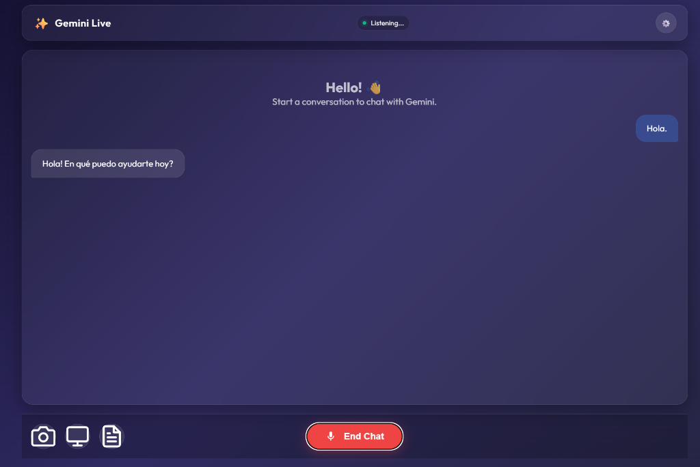

# 🎙️ Gemini Live Voice Chat

A real-time, bidirectional voice chat application powered by Google's **Gemini Live API**.
Experience fluid, natural conversations with AI using your voice, now with a stunning glassmorphic UI and perfect mobile responsiveness.




## ✨ Key Features

- **Real-time Voice Conversation**: Talk naturally to Gemini with continuous, low-latency audio streaming.
- **Improved Transcription System**:
    - **Dual-Channel Transcription**: See your own words (blue bubbles) and Gemini's responses (white bubbles) in real-time.
    - **Smart Text Merging**: Advanced frontend logic eliminates visual stuttering and duplication by intelligently merging streaming text chunks.
- **Premium Glassmorphism UI**:
    - Translucent panels with background blur.
    - Deep, dynamic gradients inspired by modern aesthetics.
    - Clean chat bubble interface for clear conversation flow.
- **Mobile First Experience**:
    - Adaptive layout (`100dvh`) that fits perfectly on mobile browsers.
    - Sticky controls that never get lost.
    - Optimized touch targets.
- **Camera & Screen Sharing**: Toggle your camera or share your screen to give Gemini real-time visual context for code reviews or troubleshooting.

## 🚀 Getting Started

### Prerequisites

- [Docker](https://www.docker.com/) installed.
- A **Google Gemini API Key** (get it from [Google AI Studio](https://aistudio.google.com/)).

### Installation

1.  **Clone the repository**:
    ```bash
    git clone https://github.com/calebrio02/Gemini-Live-API
    cd Gemini-Live-API
    ```

2.  **Configure Environment**:
    Create a `.env` file in the root directory:
    ```env
    # .env
    GEMINI_API_KEY=your_api_key_here
    PORT=3600
    DEFAULT_VOICE=Kore
    ```

3.  **Run with Docker**:
    ```bash
    docker-compose up --build
    ```

4.  **Access the App**:
    Open your browser (Chrome/Edge recommended) and go to:
    `http://localhost:3600`

    *Note: For mobile devices on the same network, use your computer's local IP address (e.g., `https://192.168.1.x:3600`). You may need to set up HTTPS or allow insecure origins for microphone access.*

## 🛠️ Tech Stack

- **Backend**: Node.js, Express, `ws` (WebSocket), Gemini Multimodal Live API.
- **Frontend**: Vanilla JavaScript, CSS3 (Glassmorphism), WebSocket API, Web Audio API.
- **Infrastructure**: Docker, Docker Compose.

## 📝 Usage Guide

1.  **Start Chat**: Click the microphone button to begin.
2.  **Speak**: Talk naturally. The "Listening..." indicator will pulse.
3.  **Read**: Watch the conversation unfold in the transcript view.
    - **User Bubbles (Right)**: Your speech, transcribed by Gemini.
    - **AI Bubbles (Left)**: Gemini's audio response, transcribed in real-time.
4.  **Controls**:
    - **Toggle Transcript**: Show/hide the text history.
    - **Camera**: Share your camera stream.
    - **Screen Share**: Share your screen/window for troubleshooting.
    - **Settings**: Change voice tone (Kore, Fenrir, Aoede, etc.) or system prompt.

## 🤝 Contributing

Contributions are welcome! Please feel free to submit a Pull Request.

---
*Built with ❤️ using Gemini API and Google Antigravity*
